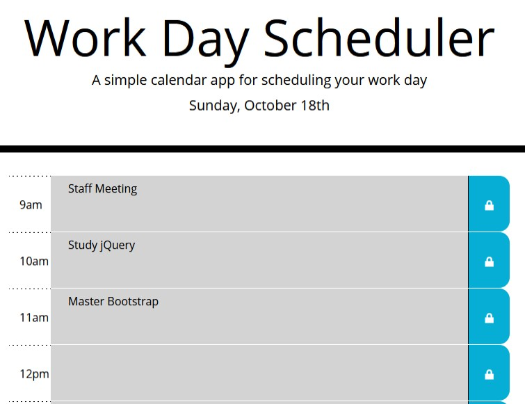

# Work Day Scheduler

  

## Description
The work day scheduler is a simple, daily task application for planning out your day. The scheduler is divided into a standard 9-5 work day, alloying users to enter a task for each hour of the day. Using the application is easy, simply click on the time block area for the hour of interest, enter a task, meeting, or any important duty that needs to be fullfilled and click the save button. The task will then be saved and appear on the scheduler.

To keep track of the past, present, and future times, the time blocks are colorized according to the time of the day. Any tasks that occur before the current time block appear in gray, the current hour appears in red, and those tasks in future appear in green. 

The tasks are saved within the local storage of the browser so reloading the page will not affect the tasks entered and will persist throughout the day, while being cleared the following day. 

## Using the Application
Using the application is simple - the project can easily be cloned or downloaded from github [here](https://yooperjb.github.io/work-day-scheduler/), which can be installed on your webserver and modified to your needs.

Because the colorized time blocks are based on text entered within the paragraph element of the HTML, using different times blocks will still work for the colorization diffeerences by simply changing the value in the custome time-block attribute. 

```
<div class="col-10 description" time-block="12">
```

## Build
The Work Day scheduler is built from jQuery, and javascript using bootstrap primarily for layout. 

## Viewing the Scheduler
The Work Day Scheduler can be viewed on GitHub pages [here](https://yooperjb.github.io/work-day-scheduler/). 

